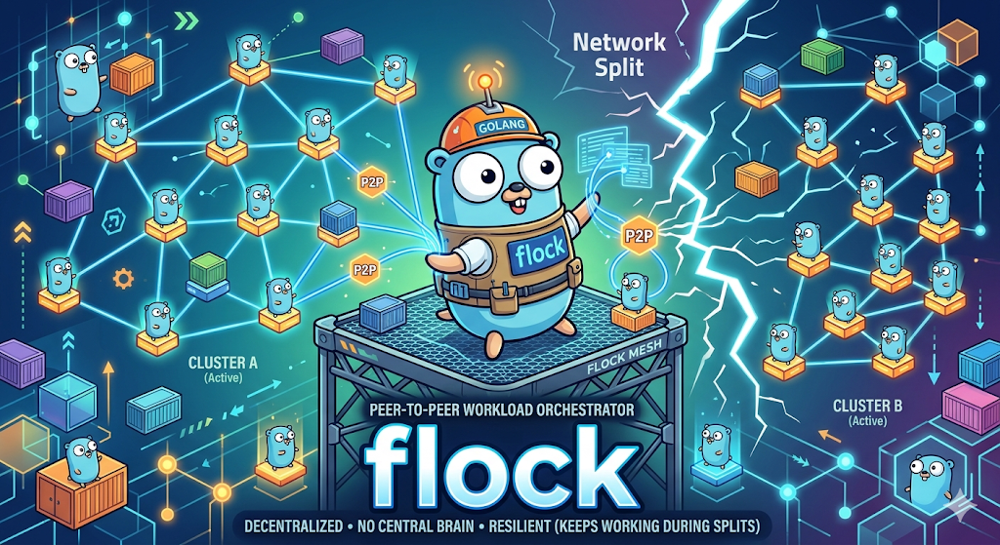
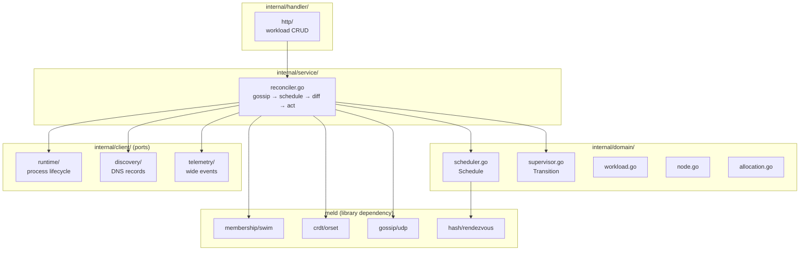
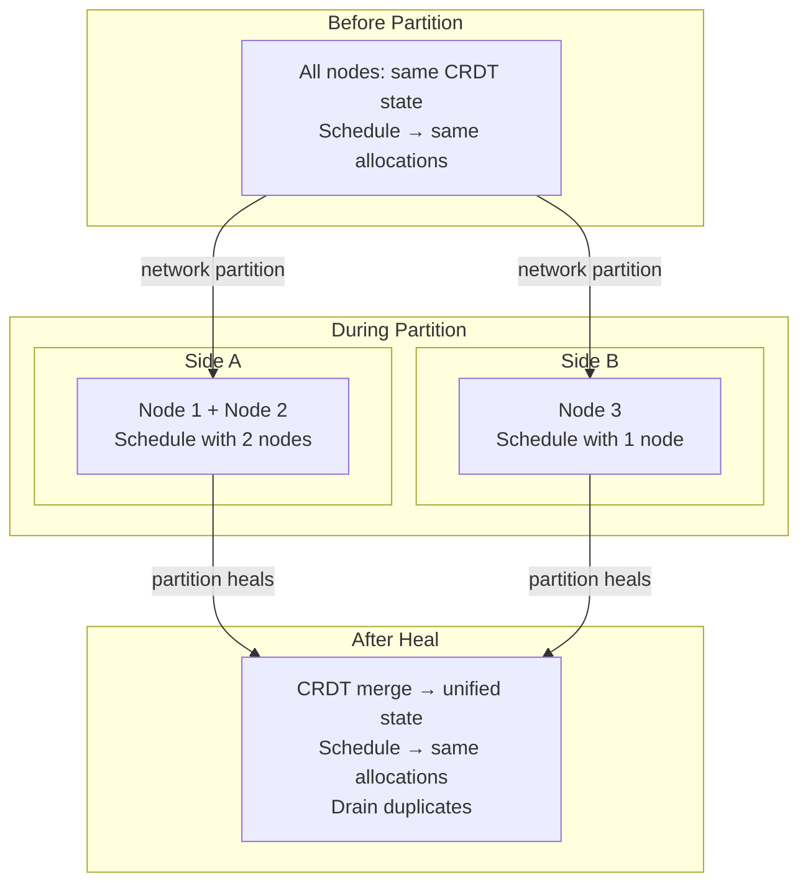

# flock

  

Peer-to-peer workload orchestrator.

Single binary, no external dependencies. Every node runs the same binary, joins via gossip, and can accept workload submissions. No node stores an allocation table. Instead, every node calls a deterministic pure function that computes allocations from the current set of workloads and alive nodes. CRDTs guarantee all nodes converge to the same inputs, so the same function produces the same outputs everywhere. This eliminates the need for a leader, a consensus store, or reconciliation loops.

## Architecture

## Scheduling During Partitions

## Dependencies

- **meld**: CRDT types, version vectors, gossip transport, SWIM membership. Must be complete.
